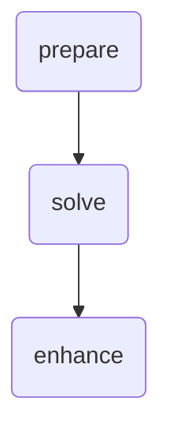

# Chain example

A simple chain pipeline.

## Graph


```mermaid
graph TD
  prepare(prepare)
  prepare --> solve
  solve(solve)
  solve --> enhance
  enhance(enhance)
```

## Usage

```bash
nextmv app push -a <app-id>
echo '{"hello": "world!"}' | nextmv app run -a <app-id> -e "8c16gb12h"
```
