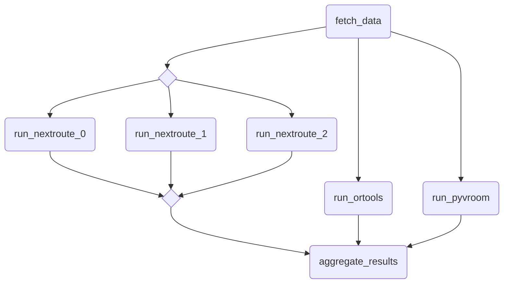

# Complex example

A more complex pipeline combining some concepts.

## Graph


```mermaid
graph TD
  fetch_data(fetch_data)
  fetch_data --> run_nextroute
  fetch_data --> run_ortools
  fetch_data --> run_pyvroom
  run_nextroute{ }
  run_nextroute_join{ }
  run_nextroute_0(run_nextroute_0)
  run_nextroute --> run_nextroute_0
  run_nextroute_0 --> run_nextroute_join
  run_nextroute_1(run_nextroute_1)
  run_nextroute --> run_nextroute_1
  run_nextroute_1 --> run_nextroute_join
  run_nextroute_2(run_nextroute_2)
  run_nextroute --> run_nextroute_2
  run_nextroute_2 --> run_nextroute_join
  run_nextroute_join --> aggregate_results
  run_ortools(run_ortools)
  run_ortools --> aggregate_results
  run_pyvroom(run_pyvroom)
  run_pyvroom --> aggregate_results
  aggregate_results(aggregate_results)
```

## Usage

```bash
nextmv app push -a <app-id>
echo '{}' | nextmv app run -a <app-id> -e "8c16gb12h"
```
