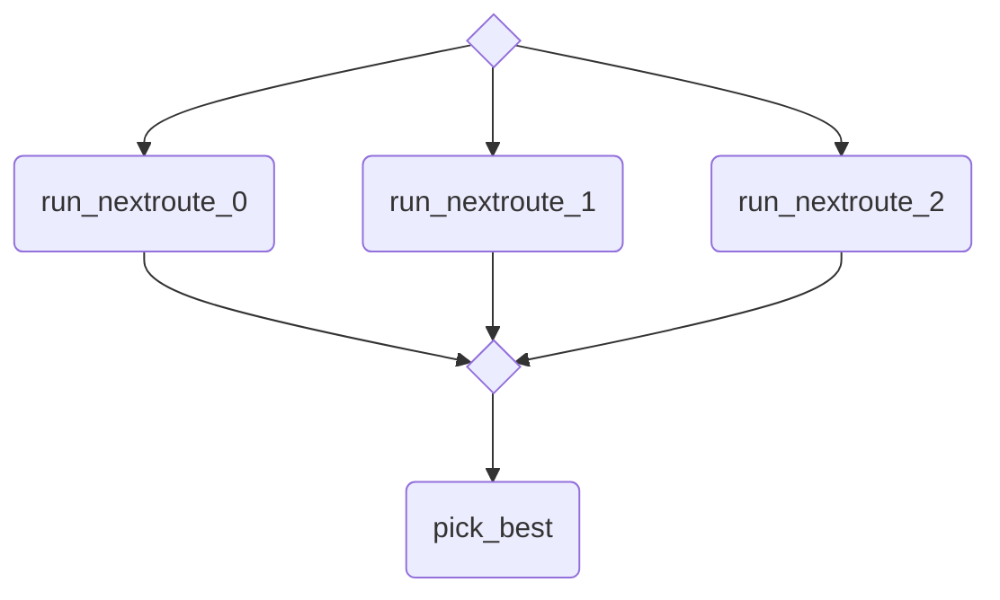

# Ensemble example

A basic ensemble pipeline.

## Graph


```mermaid
graph TD
  run_nextroute{ }
  run_nextroute_join{ }
  run_nextroute_0(run_nextroute_0)
  run_nextroute --> run_nextroute_0
  run_nextroute_0 --> run_nextroute_join
  run_nextroute_1(run_nextroute_1)
  run_nextroute --> run_nextroute_1
  run_nextroute_1 --> run_nextroute_join
  run_nextroute_2(run_nextroute_2)
  run_nextroute --> run_nextroute_2
  run_nextroute_2 --> run_nextroute_join
  run_nextroute_join --> pick_best
  pick_best(pick_best)
```

## Usage

```bash
nextmv app push -a <app-id>
cat /path/to/routing/input.json | nextmv app run -a <app-id> -e "8c16gb12h"
```
