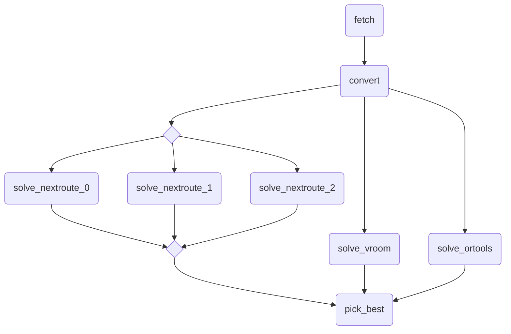

# CSV to JSON multi-solver ensemble example

An example of a pipeline fetching CSV data, converting it to JSON, ensembling across multiple solvers and repetitions and picking the best result.

## Graph



## Usage

```bash
nextmv app push -a <app-id>
echo '{}' | nextmv app run -a <app-id> -e "8c16gb12h"
```
